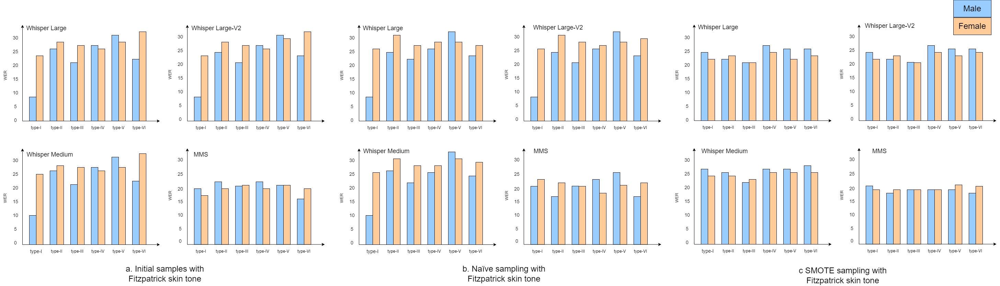
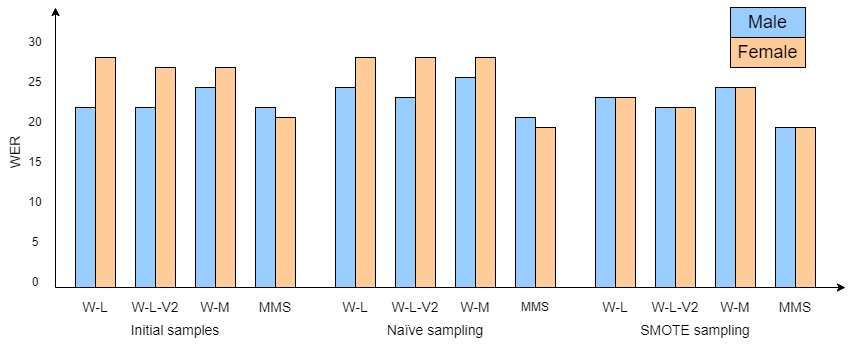
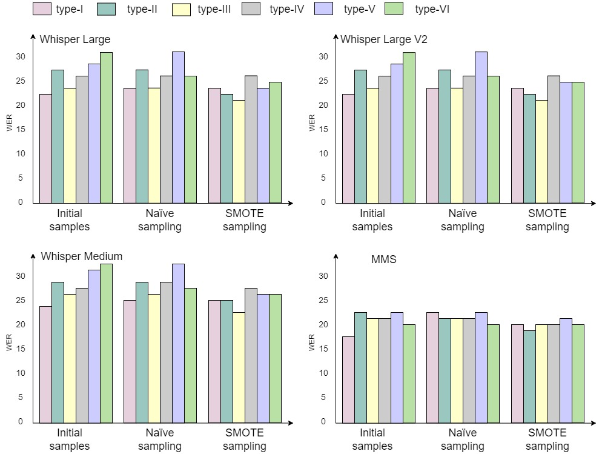
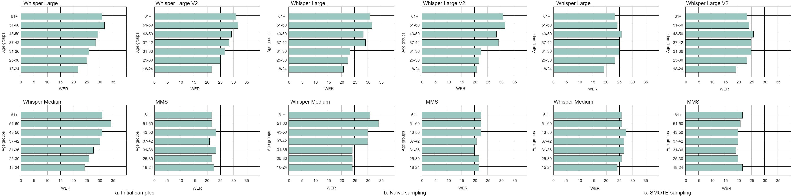
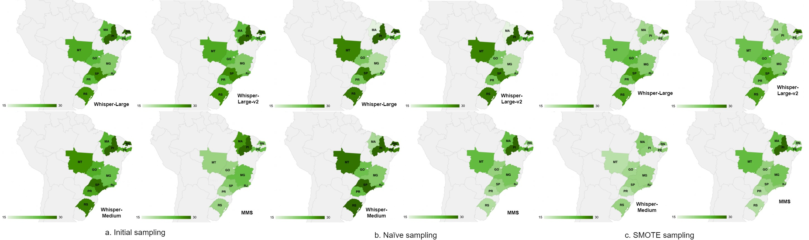

# The balancing Act: unmasking and alleviating ASR Biases in Portuguese

In the field of spoken language understanding, systems like Whisper and Multilingual Massive Speech (MMS) have shown state-of-the-art performances. This study is dedicated to a comprehensive exploration of the Whisper and MMS systems, with a focus on assessing biases inherent in casual conversation speech specific to the Portuguese language. Our investigation encompasses various subgroups, including those categorized by gender, age, skin tone color, and geo-location. Alongside traditional ASR evaluation metrics such as Word Error Rate (WER) and Character Error Rate (CER), we have incorporated the computation of bias ratios, accompanied by p-values to substantiate the statistical significance of our findings across different subgroups. This research represents a pioneering effort in quantifying biases in the Portuguese language context through the application of MMS and Whisper, contributing to a better understanding of ASR systems' performance in multilingual settings.

## Contributions

The main contributions of this paper are as follows: 

- It presents the first study on analyzing disparities within multilingual ASR systems focused on the Portuguese language.
- It emphasizes the critical significance of data distribution among sub-categories by employing oversampling techniques.
- It illustrates the comparative distinctions between Whisper ASR and MMS ASR, and examines the impact of model parameters on developing an efficient system design.
- Besides gender and age groups, it investigates skin tone and geo-location as criteria to measure inter-racial biases.

## Results

<figure>
    
    <figcaption>Figure 1: Bar plots depicting Whisper and ASR performance across the Fitzpatrick skin-tone scale, ranging from
type-I to type-VI, for both male and female genders, with results for initial samples, naïve sampling, and SMOTE
sampling</figcaption>
</figure>
   

<figure>
    
    <figcaption>Figure 2: Bar-plots demonstrating performance of multilingual ASR systems using Whisper ASR variants and MMS for impact on male and female genders using WER under three sampling methods, initial, naïve and SMOTE. Whisper ASR variants are indicated as, Whisper-Large (W-L), Whisper-Large-V2 (W-L-V2), and Whisper-Medium (W-M).</figcaption>
</figure>

   

<figure>
    
    <figcaption>Figure 3: Bar-plots illustrating the distribution of mean WER for Fitzpatrick skin tone scales across Initial, naïve, and SMOTE sampling methods.</figcaption>
</figure>

   

<figure>
    
    <figcaption>Figure 4: Bar-plots illustrating distribution of WER for age groups categorized into five sub-sets (18-24, 25-30, 31-36,  37-42, 42-50, 51-60, 61+) across initial, naïve and SMOTE sampling methods.</figcaption>
</figure>

   

<figure>
    
    <figcaption>Figure 5:The visualization of mean WER distribution in each Portuguese state. The abbreviations of states are as follows: RN - Rio Grande do Norte, SP - Sao Paulo, RS - Rio Grande do Sul, GO -Goias, MT - Mato Grosso, PR - Parana, RJ - Rio de Janeiro, MG - Minas Gerais, PI - Piaui, PE - Pernambuco, MA - Maranhao.</figcaption>
</figure>
